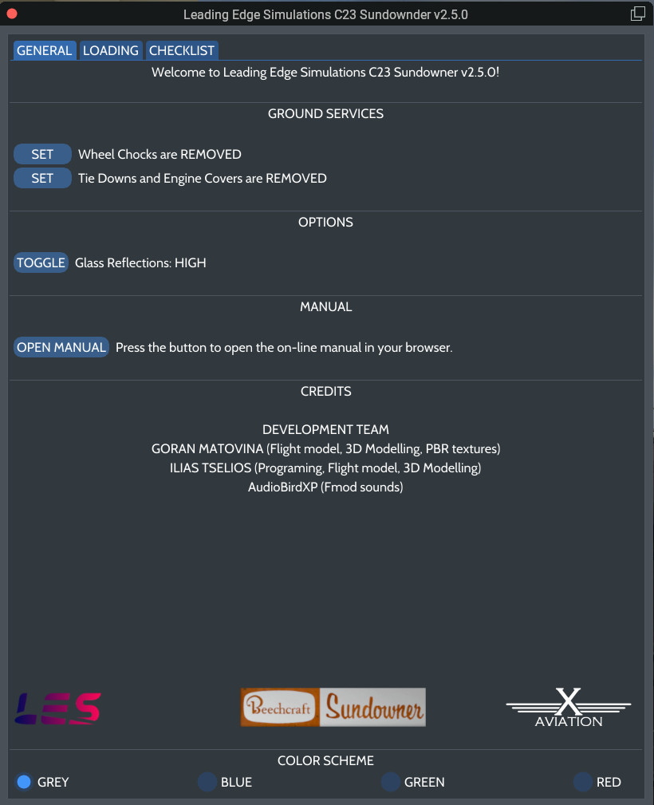
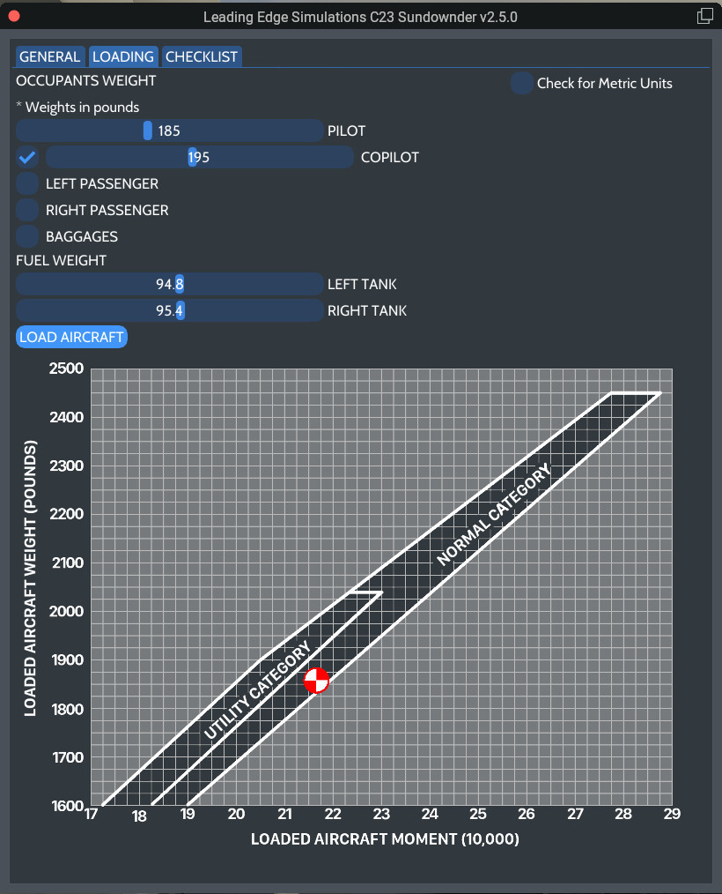
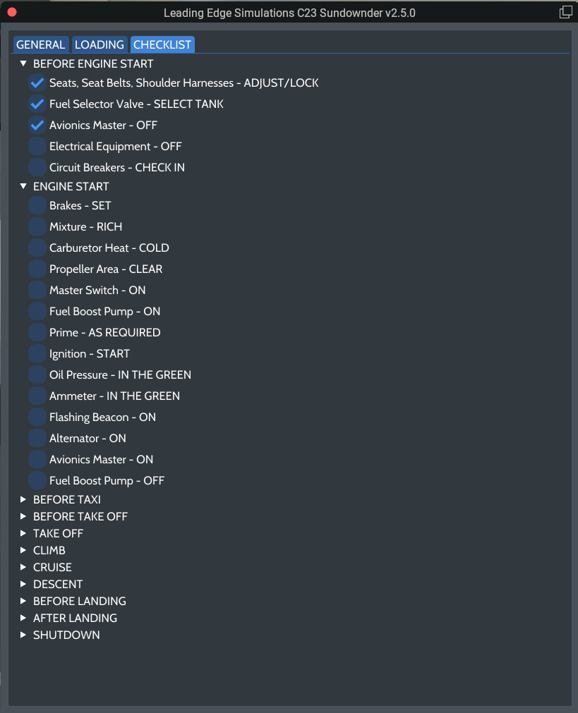

# User Interface

The user interface is the means for the user to interact with various faces of the flight, and as well as set various options, aircraft loading, etc.
It is divided in 3 tabs.

## GENERAL
This tab allows the user to control ground services, options, access the on-line manual, select color cheme, and display the credits.

## LOADING
This allows the user, first of all, to select the desired units. 
The **PILOT** slider is always enabled, since, at least a pilot, is required to fly the aircraft! You can adjust the weight, by sliding the handle. 
The sliders for **COPILOT** (or right front seat), **Left Passenger**, **Right Passenger**, and **Baggages**, require first to enable them trought the respective checkbox, and the asjust the weigh for each. 
Also, the **Fuel Tank** sliders are always enabled, and preloaded with the existing fuel. Use the sliders to set the fuel weight you want. 
While you are adjusting the weight for each station, the changes will not take place until you press the **LOAD AIRCRAFT** button.
The diagram below shows the current **Center Of Gravity (CG)** of the aircraft.

!!! danger "WARNING"
    Fuel loading is not possible with the engine running!

## CHECKLIST
A complete checklist, adapted for our aircraft. 

